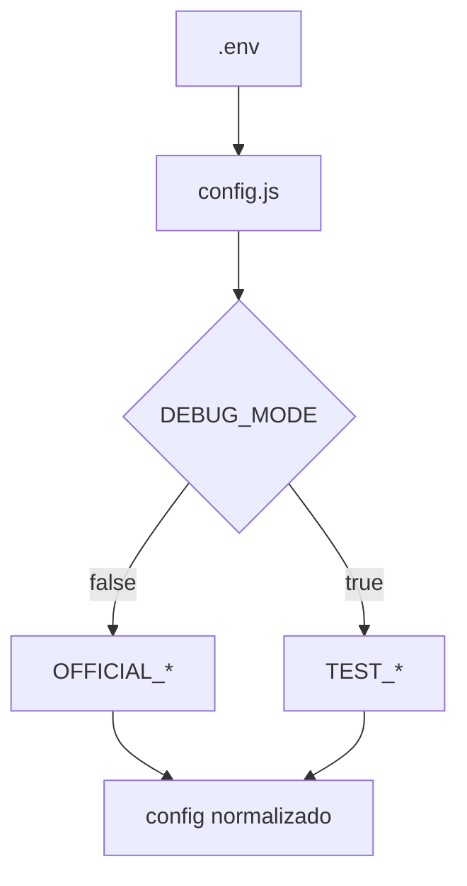
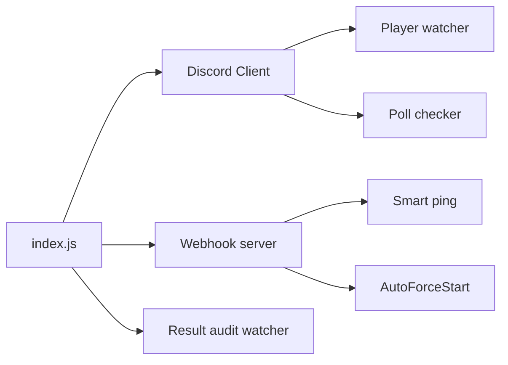
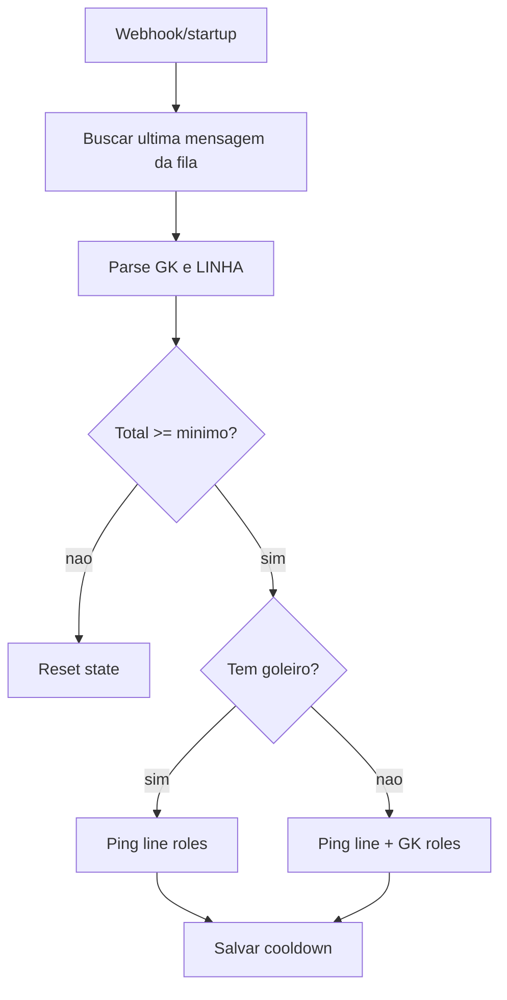
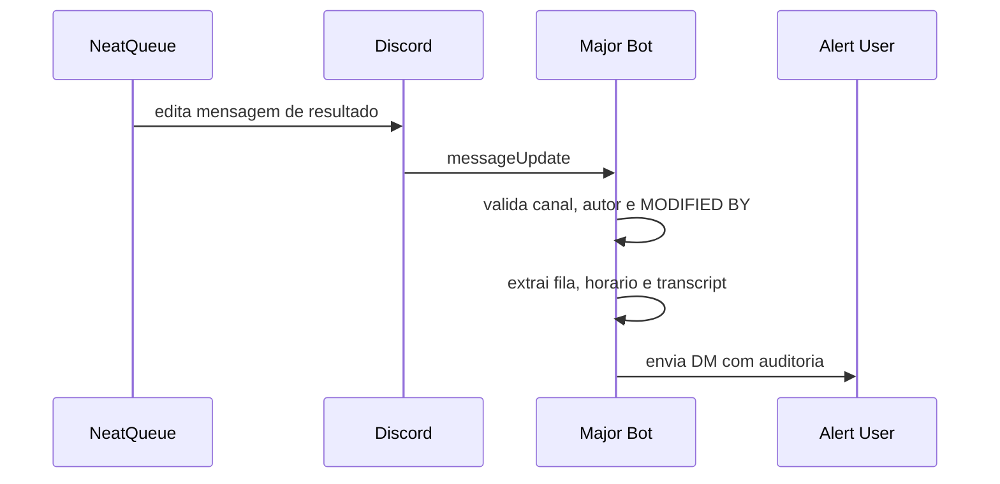

# Major Bot Architecture

## Sumario

- [Visao Geral](#visao-geral)
- [Arvore do Projeto](#arvore-do-projeto)
- [Resolucao de Perfil](#resolucao-de-perfil)
- [Fluxo Principal](#fluxo-principal)
- [Smart Ping](#smart-ping)
- [AutoForceStart](#autoforcestart)
- [Polls e Progressao](#polls-e-progressao)
- [Auditoria de Resultados Alterados](#auditoria-de-resultados-alterados)
- [Persistencia](#persistencia)
- [Scripts de Desenvolvimento](#scripts-de-desenvolvimento)
- [Change Log](#change-log)

## Visao Geral

O bot e dividido em um bootstrap na raiz (`index.js`) e modulos em `src/` separados por responsabilidade:

- `src/services`: integracoes e loops principais
- `src/database`: schema, queries e backup
- `src/utils`: config, JSON state, trilhas de cargo e helpers
- `src/ui`: mensagens centralizadas
- `src/commands`: ponto unico de slash commands
- `dev`: scripts operacionais

O runtime usa:

- Postgres para progresso e votos
- JSON local em `data/` para estado transitiorio
- Discord para interacao, filas e auditoria
- NeatQueue API + webhook para estado da fila e forcestart

## Arvore do Projeto

```text
.
|-- index.js
|-- package.json
|-- README.md
|-- ARCHITECTURE.md
|-- .env.example
|-- dev/
|   |-- clear-global-resources.js
|   `-- deploy-commands.js
|-- src/
|   |-- commands/
|   |   `-- index.js
|   |-- database/
|   |   |-- backup.js
|   |   `-- create.js
|   |-- services/
|   |   |-- forceStart.js
|   |   |-- logger.js
|   |   |-- neatqueue.js
|   |   |-- playerWatcher.js
|   |   |-- polls.js
|   |   |-- resultAudit.js
|   |   |-- rolePing.js
|   |   `-- webhook.js
|   |-- ui/
|   |   `-- messages.js
|   `-- utils/
|       |-- config.js
|       |-- jsonStore.js
|       |-- roleTracks.js
|       `-- time.js
|-- data/
`-- backups/
```

## Resolucao de Perfil

O projeto usa dois perfis no mesmo `.env`:

- `OFFICIAL_*`
- `TEST_*`

O seletor e `DEBUG_MODE`.

- `false`: perfil oficial
- `true`: perfil de testes

O loader em `src/utils/config.js`:

1. Le variaveis compartilhadas
2. Monta os dois perfis
3. Seleciona o perfil ativo
4. Normaliza tudo em um unico objeto `config`
5. Calcula derivados como `AUTO_FORCESTART_DELAY_MS` e `SMART_PING_COOLDOWN_MS`



## Fluxo Principal

`index.js` faz o bootstrap completo:

1. carrega `dotenv`
2. cria o `Client`
3. registra watcher de auditoria
4. sobe o webhook HTTP
5. inicia o timer do AutoForceStart
6. faz login no Discord
7. no `clientReady`:
   - inicializa banco
   - envia mensagem de startup
   - restaura polls pendentes
   - avalia smart ping
   - executa o primeiro ciclo do watcher de players
   - agenda os loops recorrentes



## Smart Ping

Arquivo principal: `src/services/rolePing.js`

O smart ping nao usa mais intervalo fixo. Ele reage a eventos da fila e ao startup.

### Entradas

- `JOIN_QUEUE`
- `LEAVE_QUEUE`
- `MATCH_CANCELLED`
- restore no startup

### Regras

1. Buscar as mensagens recentes do `QUEUE_CHANNEL_ID`
2. Filtrar pela ultima mensagem do bot `NEATQUEUE_BOT_ID`
3. Garantir que o texto corresponde a `QUEUE_NAME`
4. Parsear:
   - `GK x/2`
   - `LINHA y/10`
5. Se `totalPlayers < SMART_PING_MIN_PLAYERS`, resetar elegibilidade
6. Se `gkCount >= 1`, pingar:
   - `ROLES_MAJOR`
   - `ROLES_TEST_MAJOR`
7. Se `gkCount === 0`, pingar:
   - `ROLES_MAJOR`
   - `ROLES_TEST_MAJOR`
   - `ROLES_GKMAJOR`
   - `ROLES_TEST_GKMAJOR`
8. Aplicar cooldown com `SMART_PING_COOLDOWN_SECONDS`

Estado salvo:

- `lastPingAt`
- `lastParsedMessageId`
- `lastSignature`
- `qualified`



## AutoForceStart

Arquivo principal: `src/services/forceStart.js`

O webhook informa o total da fila. Quando a fila atinge o ponto configurado:

- `TARGET_PLAYERS = AUTO_FORCESTART_MIN_GK + AUTO_FORCESTART_MIN_LINHA`
- `FULL_PLAYERS = TARGET_PLAYERS + 1`

Se a fila ficar parada em `TARGET_PLAYERS` por `AUTO_FORCESTART_DELAY_SECONDS`, o bot chama a API do NeatQueue para forcestart.

O estado salvo em JSON evita perder o timer entre ciclos do processo.

## Polls e Progressao

Arquivos principais:

- `src/services/playerWatcher.js`
- `src/services/polls.js`
- `src/utils/roleTracks.js`

Fluxo:

1. `playerWatcher` consulta a API do NeatQueue
2. cruza cada jogador com o Discord
3. identifica em qual trilha de teste ele esta:
   - `major`
   - `gkmajor`
   - ambas, se necessario
4. quando cruza `POLL_THRESHOLD_GAMES`, abre enquete
5. a resolucao da enquete atualiza:
   - cargos
   - status no banco
   - estado pendente em JSON

O banco e escopado por `server_id`, evitando colisao entre oficial e teste.

## Auditoria de Resultados Alterados

Arquivo principal: `src/services/resultAudit.js`

O bot escuta `messageUpdate` e so processa mensagens que:

- estejam em `RESULTS_CHANNEL_ID`
- sejam do `NEATQUEUE_BOT_ID`
- contenham `MODIFIED BY`

Quando encontra uma alteracao:

1. extrai o nome de quem alterou
2. usa `editedTimestamp` como horario principal da edicao
3. extrai o numero da fila do embed
4. localiza o botao `Transcript`
5. envia DM para `RESULTS_ALERT_USER_ID`
6. salva uma chave de dedupe `messageId:editedTimestamp`



## Persistencia

### Postgres

Tabelas principais:

- `player_game_progress`
- `test_player_votes`

Cada uma agora possui `server_id`, e as constraints sao escopadas por servidor.

### JSON local em `data/`

Arquivos por perfil/servidor:

- `pending_polls_<profile>_<serverId>.json`
- `queue_watch_state_<profile>_<serverId>.json`
- `smart_ping_state_<profile>_<serverId>.json`
- `results_alert_state_<profile>_<serverId>.json`

Migracao legada:

- `json/pending_pool.json`
- `json/pending_polls.json`

Esses arquivos antigos sao absorvidos automaticamente no perfil oficial.

## Scripts de Desenvolvimento

- `npm start`: sobe o bot com o perfil ativo
- `npm run dev`: sobe com watch
- `npm run deploy`: registra slash commands usando `CLIENT_ID` do perfil ativo
- `npm run clear`: limpa comandos globais usando `CLIENT_ID` do perfil ativo
- `npm run backup`: exporta snapshots JSON do banco

## Change Log

- 2026-04-15 00:17:58 -03:00 | Model: GPT-5 Codex | Nota: introduzido env com perfis `OFFICIAL_*` e `TEST_*`, smart ping orientado por fila, auditoria de resultados alterados por DM, docs tecnicas consolidadas.
